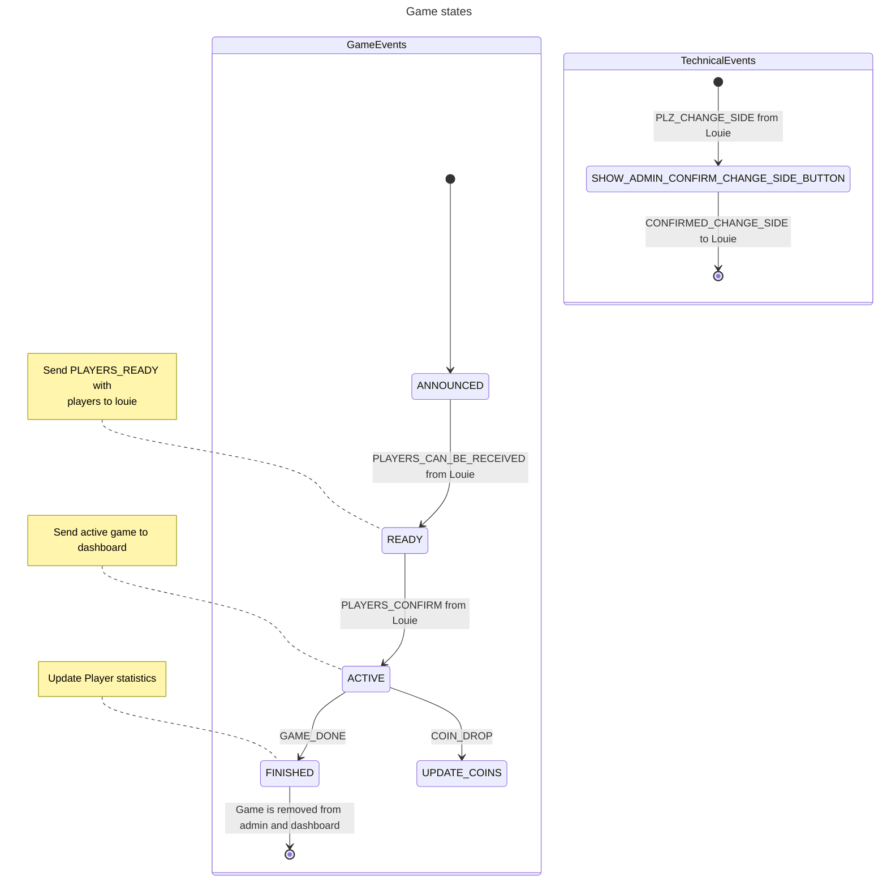

## Looping-Louie-Administrator

- [Looping-Louie-Administrator](#looping-louie-administrator)
    * [System overview](#system-overview)
    * [Docker commands](#docker-commands)
    * [How to test kafka setup](#how-to-test-kafka-setup)
        + [Examples for game state changes](#examples-for-game-state-changes)

This application, written in golang, provides some endpoints (REST, HTTP, Websockets) for the
louie-dashboard written in angular. The idea behind this application is an offline
louie solution without a firedb.
Otherwise, exists a basic admin interface (written in HTML, CSS, JQuery, htmx). This interface 
give the admin the possibility to create users or start games.

### System overview

The following chart describes the interaction of the physical louie, the dashboard and the administration interface. 

 ```mermaid 
---
title: System
---
graph LR

    subgraph pi
        c-library --> jan-ki-magic
        jan-ki-magic --- id1(kafka)
        louie-web-administrator --- id1(kafka)
        louie-dashboard --rest/http--> louie-web-administrator
    end
    louie --> c-library
    admin --start game/ select users for game--> louie-web-administrator
    user --registration--> louie-dashboard
 ```

Class diagram to visualize the communication between the components/packages:

 ```mermaid 
---
title: Louie-web-administrator
---
classDiagram
    Controller --> Websocket
    Controller --> Service
    User --> Service
    Service --> Websocket
    Service --> Repository
    Service --> Kafka

    class Service {
        services control the game state 
        and handle operations for
        users and games
    }

    class User {
        handle only the register user
        request from dashboard
    }

    class Websocket {
        send messages to
        the dashboard and
        refresh the admin ui. 
        coins or game state
    }
 ```

The following chart visualize the game states and possible transitions.



### Deployment

The deployment is possible via github workflows:

```bash
# 1. First create a tag and add a short description for the release
git tag -a $(git rev-parse --short HEAD)
# 2. Push the tag via
git push --tags 
```
After this steps github create a new docker image taged with latest and the
current git short commit hash. 

### Docker commands

The easiest running solution is the usage of docker compose. Switch to docker directory and run:
```bash
# Starts kafka and create the docker louie network
docker-compose -f docker-compose-kafka.yml up --build -d
# Starts the admin ui and the mongo db
GIT_COMMIT_HASH=$(git rev-parse --short HEAD) DB_PASSWORD=superuser docker-compose up --build -d
```
Please use a better pw if you deploy or run to production environment!
The service need a started kafka (started with separate docker-compose). 

### How to test kafka setup

If you want to develop locally with kafka and want to test that your receiving or producing of messages work do the 
following:

1. First start the kafka development docker container:
```bash
docker-compose -f docker/docker-compose-kafka.yml up --build -d
```
2. Now install kcat/kafkacat. That helps you to produce or consume messages from shell
```bash
brew install kcat
```
3. Produce or Consume messages from shell. If you do this the first time. Produce a message to create the topic!
```bash
# Producing 
echo 'publish to partition 0' | kcat -P -b localhost:9093 -t LOUIE_EVENT -p 0
# Consuming
kcat -C -b localhost:9093 -t LOUIE_EVENT -p 0
```

You can test the producer and consumer, with started kafka docker compose, with the kafka/producer_test.go. Define a
ENABLE_KAFKA_TEST env for that.

#### Examples for game state changes

Look on [System overview](#system-overview) statemachine (game states) to get additional
information for the events.

```bash
echo '{"event":"PLAYERS_CAN_BE_RECEIVED"}' | kcat -P -b localhost:9093 -t LOUIE_EVENT -p 0
```
```bash
echo '{"event":"PLAYERS_CONFIRM"}' | kcat -P -b localhost:9093 -t LOUIE_EVENT -p 0
```
```bash
echo '{"event":"GAME_DONE", "duration": 17.440526723861694, "winning_player": {"name": "anton"}}' | kcat -P -b localhost:9093 -t LOUIE_EVENT -p 0
```
```bash
echo '{"event":"COIN_DROP", "name": "willi", "coins": 2}' | kcat -P -b localhost:9093 -t LOUIE_EVENT -p 0
```